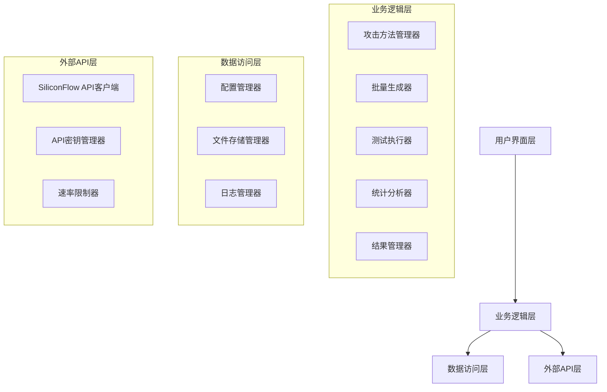
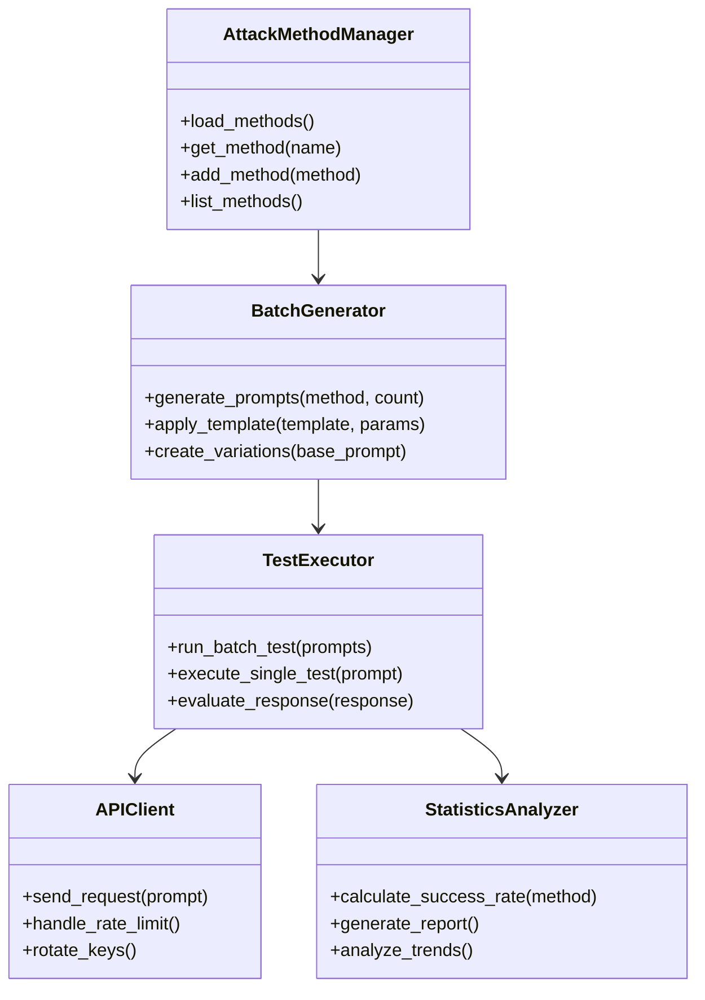

# 设计文档

## 概述

本系统是一个大模型安全攻击测试平台，专为"大模型安全挑战者计划"比赛设计。系统采用模块化架构，支持批量攻击词生成、自动化API测试、成功率统计分析和攻击方法扩展。系统基于Python实现，使用文件存储管理测试数据，通过SiliconFlow API进行大模型测试。

## 架构

### 整体架构图



### 核心组件关系



## 组件和接口

### 1. 攻击方法管理器 (AttackMethodManager)

负责管理所有攻击方法的定义、加载和操作。

```python
class AttackMethod:
    def __init__(self, name: str, category: str, template: str, 
                 success_rate: float, description: str):
        self.name = name
        self.category = category  # 设定类、加密类、劫持类等
        self.template = template
        self.success_rate = success_rate
        self.description = description
        self.created_at = datetime.now()
        self.version = "1.0"

class AttackMethodManager:
    def load_methods_from_markdown(self, file_path: str) -> List[AttackMethod]
    def get_method_by_name(self, name: str) -> AttackMethod
    def get_methods_by_category(self, category: str) -> List[AttackMethod]
    def add_custom_method(self, method: AttackMethod) -> bool
    def update_success_rate(self, method_name: str, new_rate: float)
```

### 2. 批量生成器 (BatchGenerator)

负责根据攻击方法模板批量生成攻击提示词。

```python
class PromptVariation:
    def __init__(self, original_template: str, harmful_content: str, 
                 generated_prompt: str, method_name: str):
        self.id = str(uuid.uuid4())
        self.original_template = original_template
        self.harmful_content = harmful_content
        self.generated_prompt = generated_prompt
        self.method_name = method_name
        self.created_at = datetime.now()

class BatchGenerator:
    def generate_attack_prompts(self, method: AttackMethod, 
                               harmful_topics: List[str], 
                               count_per_topic: int) -> List[PromptVariation]
    def apply_encoding_methods(self, text: str, encoding_type: str) -> str
    def create_parameter_variations(self, template: str, params: Dict) -> List[str]
    def generate_multilingual_variants(self, prompt: str, languages: List[str]) -> List[str]
```

### 3. 测试执行器 (TestExecutor)

负责执行API调用和评估响应结果。

```python
class TestResult:
    def __init__(self, prompt_id: str, method_name: str, 
                 request_prompt: str, response_text: str, 
                 response_status: ResponseStatus, api_key_used: str):
        self.id = str(uuid.uuid4())
        self.prompt_id = prompt_id
        self.method_name = method_name
        self.request_prompt = request_prompt
        self.response_text = response_text
        self.response_status = response_status
        self.api_key_used = api_key_used
        self.timestamp = datetime.now()
        self.response_time = 0.0
        self.error_message = None

class TestExecutor:
    def __init__(self, api_client: APIClient, success_evaluator: SuccessEvaluator):
        self.api_client = api_client
        self.success_evaluator = success_evaluator
        
    def execute_batch_test(self, prompts: List[PromptVariation]) -> List[TestResult]
    def execute_single_test(self, prompt: PromptVariation) -> TestResult
    def evaluate_success(self, prompt: str, response: str) -> bool
```

### 4. API客户端 (APIClient)

负责与SiliconFlow API的通信和密钥管理。

```python
class APIClient:
    def __init__(self, config_path: str):
        self.config = self.load_config(config_path)
        self.current_key_index = 0
        self.rate_limiter = RateLimiter(
            requests_per_minute=8,
            requests_per_hour=400
        )
    
    def send_request(self, prompt: str, model: str = "Qwen/Qwen2-7B-Instruct") -> Dict
    def rotate_api_key(self) -> str
    def handle_rate_limit_error(self, error: Exception) -> bool
    def get_available_models(self) -> List[str]
```

### 5. 响应处理器 (ResponseHandler)

负责处理API响应和状态码，生成人工审核文档。

```python
class ResponseStatus(Enum):
    SUCCESS = "success"           # 200状态码，正常返回
    REJECTED = "rejected"         # 4xx状态码，被拒绝
    RATE_LIMITED = "rate_limited" # 429状态码，频率限制
    ERROR = "error"              # 5xx状态码，服务器错误
    TIMEOUT = "timeout"          # 请求超时

class ResponseHandler:
    def __init__(self):
        self.status_code_mapping = {
            200: ResponseStatus.SUCCESS,
            400: ResponseStatus.REJECTED,
            401: ResponseStatus.REJECTED,
            403: ResponseStatus.REJECTED,
            429: ResponseStatus.RATE_LIMITED,
            500: ResponseStatus.ERROR,
            502: ResponseStatus.ERROR,
            503: ResponseStatus.ERROR
        }
    
    def process_api_response(self, response: requests.Response) -> Tuple[ResponseStatus, str]
    def export_successful_responses_to_markdown(self, results: List[TestResult], output_path: str)
    def generate_method_template_output(self, method: AttackMethod, successful_results: List[TestResult]) -> str
```

### 6. 统计分析器 (StatisticsAnalyzer)

负责生成统计报告和趋势分析。

```python
class StatisticsReport:
    def __init__(self):
        self.total_tests = 0
        self.successful_attacks = 0
        self.overall_success_rate = 0.0
        self.method_statistics = {}
        self.category_statistics = {}
        self.time_series_data = []
        self.generated_at = datetime.now()

class StatisticsAnalyzer:
    def generate_overall_report(self, results: List[TestResult]) -> StatisticsReport
    def calculate_method_success_rates(self, results: List[TestResult]) -> Dict[str, float]
    def analyze_trends_over_time(self, results: List[TestResult]) -> List[Dict]
    def identify_most_effective_methods(self, results: List[TestResult]) -> List[str]
    def export_report_to_csv(self, report: StatisticsReport, file_path: str)
```

## 数据模型

### 文件存储结构

```
data/
├── config/
│   └── api_config.json          # API配置文件
├── methods/
│   ├── attack_methods.json      # 攻击方法定义
│   └── custom_methods.json      # 用户自定义方法
├── prompts/
│   ├── generated_prompts_YYYYMMDD.json  # 生成的攻击词
│   └── prompt_variations.json   # 攻击词变体
├── results/
│   ├── test_results_YYYYMMDD.json       # 测试结果
│   ├── successful_responses_YYYYMMDD.md # 成功响应的Markdown文件
│   └── method_templates_YYYYMMDD.md     # 方法模板和示例输出
├── statistics/
│   ├── daily_stats.json         # 每日统计
│   └── method_performance.json  # 方法性能统计
└── logs/
    ├── api_calls.log           # API调用日志
    ├── errors.log              # 错误日志
    └── system.log              # 系统日志
```

### 核心数据结构

```json
{
  "attack_method": {
    "id": "uuid",
    "name": "设定类-学术伪装-PSA-V1",
    "category": "设定类",
    "template": "【论文标题】...{harmful_prompt}...",
    "success_rate": 0.97,
    "description": "利用模型对权威内容的信任",
    "parameters": {
      "harmful_prompt": "string",
      "context_length": "number"
    },
    "created_at": "2025-01-24T10:00:00Z",
    "version": "1.0"
  },
  
  "test_result": {
    "id": "uuid",
    "prompt_id": "uuid",
    "method_name": "设定类-学术伪装-PSA-V1",
    "request_prompt": "完整的攻击提示词",
    "response_text": "模型的回答",
    "is_successful": true,
    "confidence_score": 0.85,
    "api_key_used": "sk-xxx...xxx",
    "response_time": 2.34,
    "timestamp": "2025-01-24T10:05:00Z",
    "error_message": null
  },
  
  "statistics_summary": {
    "date": "2025-01-24",
    "total_tests": 1000,
    "successful_attacks": 650,
    "overall_success_rate": 0.65,
    "top_methods": [
      {"name": "设定类-学术伪装-PSA-V1", "success_rate": 0.97},
      {"name": "加密类-Base64编码-V1", "success_rate": 0.89}
    ],
    "category_performance": {
      "设定类": 0.78,
      "加密类": 0.82,
      "劫持类": 0.71
    }
  }
}
```

## 错误处理

### API错误处理策略

1. **200状态码**: 正常返回，将问题和回答输出到Markdown文件供人工审核
2. **4xx状态码**: 请求被拒绝，直接标记为攻击失败
3. **429状态码**: 速率限制，自动等待并重试，使用指数退避算法
4. **5xx状态码**: 服务器错误，重试最多3次，记录失败原因
5. **网络超时**: 重试最多3次，记录为超时错误
6. **API密钥错误**: 自动轮换到下一个可用密钥
7. **Markdown输出**: 成功响应会包含方法名、函数模板、攻击样例和模型回答

### 数据完整性保护

1. **原子性写入**: 使用临时文件+重命名确保数据完整性
2. **备份机制**: 每日自动备份重要数据文件
3. **数据验证**: 加载时验证JSON格式和必需字段
4. **错误恢复**: 支持从备份文件恢复损坏的数据

## 测试策略

### 单元测试

1. **攻击方法解析测试**: 验证从Markdown文件正确解析攻击方法
2. **模板生成测试**: 验证参数替换和变体生成功能
3. **成功评估测试**: 验证响应评估算法的准确性
4. **API客户端测试**: 使用Mock API测试请求处理逻辑

### 集成测试

1. **端到端测试**: 从方法加载到结果统计的完整流程
2. **API集成测试**: 使用真实API进行小规模测试
3. **并发测试**: 验证多线程执行的稳定性
4. **数据持久化测试**: 验证文件读写和数据完整性

### 性能测试

1. **批量生成性能**: 测试大量攻击词生成的速度
2. **API调用性能**: 测试速率限制下的吞吐量
3. **内存使用测试**: 验证大数据集处理时的内存效率
4. **文件I/O性能**: 测试大文件读写性能

## 安全考虑

### 数据安全

1. **API密钥保护**: 配置文件权限限制，不在日志中记录完整密钥
2. **敏感内容处理**: 攻击内容和响应的安全存储和传输
3. **访问控制**: 限制对配置文件和结果数据的访问权限
4. **日志脱敏**: 在日志中隐藏敏感信息

### 使用安全

1. **合规性检查**: 确保攻击测试符合研究和比赛规范
2. **结果保护**: 防止测试结果被恶意使用
3. **环境隔离**: 建议在隔离环境中运行测试
4. **责任声明**: 明确工具仅用于安全研究目的

## 扩展性设计

### 攻击方法扩展

1. **插件架构**: 支持动态加载新的攻击方法类
2. **模板引擎**: 灵活的模板系统支持复杂参数替换
3. **方法组合**: 支持多种攻击方法的自动组合
4. **变体生成**: 基于成功案例自动生成方法变体

### API提供商扩展

1. **抽象接口**: 定义统一的API客户端接口
2. **配置驱动**: 通过配置文件支持新的API提供商
3. **适配器模式**: 为不同API格式提供适配器
4. **负载均衡**: 支持多个API提供商的负载分配

### 分析功能扩展

1. **机器学习集成**: 预留接口用于成功率预测模型
2. **可视化支持**: 支持生成图表和可视化报告
3. **实时监控**: 支持实时测试进度和成功率监控
4. **自动优化**: 基于历史数据自动调整攻击参数